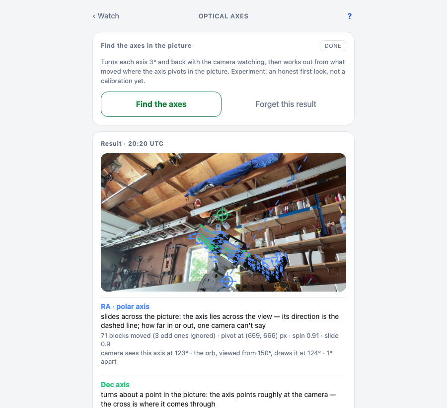
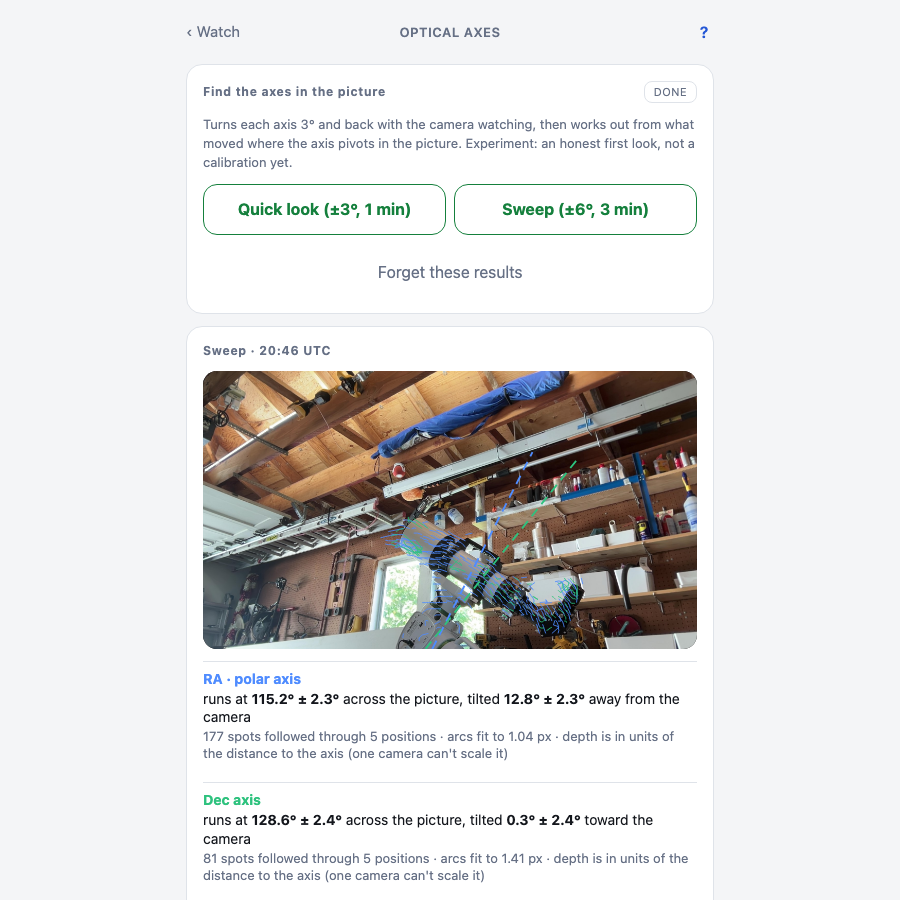
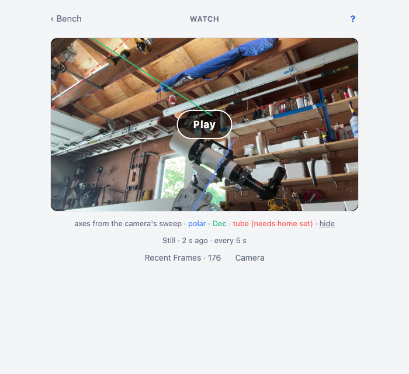
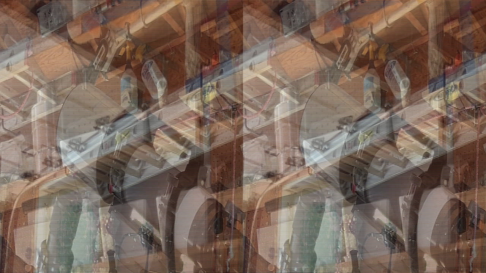

A camera that knows where the mount's axes are in its picture can draw them over the live view, notice when the mount moves without being told to, and eventually, with more cameras, measure how a mount really behaves. This is the first step, and it's an experiment. The page says so.

The code is `Controller.Optical.{Frame, Flow, Pivot, Track, Fit, Axis3D, Rig, AxisScan}` in `apps/controller/lib/controller/optical/`. The review that took it apart is on [issue #51](https://github.com/bradgessler/observatory/issues/51).

## The setup

A webcam on a shelf in the garage, looking at the mount from the side and a little below. The Watch page already showed its picture; `AxisScan` adds a procedure: take a still, turn RA 3°, take a still, turn back. Same for Dec.

## Quick look: where does it pivot in the picture

Each JPEG becomes a small grey frame (640×360, via a tiny stb_image NIF). `Flow` cuts it into 8-pixel blocks, and for every block with some texture searches a small window in the second frame for the best match by sum of absolute differences. Blocks that didn't move drop out; the shelves, the wall, the ladder. What remains is the tube and the counterweight.

`Pivot` fits a rotation centre to those arrows. For a spin in the image plane every displacement is perpendicular to the line from the centre, which is a 2×2 least-squares solve. It also says how much the field looks like a spin about a point versus a slide, because an axis lying across the view doesn't have a pivot point in the picture at all.

```elixir
# apps/controller/lib/controller/optical/pivot.ex
# coherence: 1 when every vector points the same way (a slide), ~0 when they fan out (a spin)
mean_len = Enum.sum(Enum.map(vectors, fn v -> :math.sqrt(v.dx * v.dx + v.dy * v.dy) end)) / n
coherence = if mean_len < 1.0e-6, do: 0.0, else: :math.sqrt(mdx * mdx + mdy * mdy) / mean_len
```



From this camera position RA is a slide: the tube and dovetail all move up-left together. That's what a 3-D rotation about an axis lying across the view looks like in 2-D, and the fit says so. The honest output for a slide is the axis's direction in the picture, perpendicular to the flow, drawn as a dashed line. Dec turns about a point, so it gets a cross.

This part works. The camera reads the polar axis at 119° to 123° in the picture every time, and the orb's geometry (tilt 38°, heading 13° east, viewed from azimuth 150°) projects it at 124°. A degree or two apart, with no camera calibration at all.

## Sweep: the axis in space

The ambitious part. Five stills per axis across ±6° or ±20°. `Track` follows the same spots frame to frame. `Axis3D` assumes a pinhole camera with the field of view from the Camera page and fits the axis as a "turntable": every spot rides a circle around the axis, the encoders say the turn angle at each frame, and the arcs' curvature pins the axis down in depth as well as in the picture. It's a separable Levenberg-Marquardt, four axis numbers outside and one tiny circle fit per spot inside, and it runs in seconds. Margins are 1σ from the covariance plus a bootstrap over the spots.

Then `fit_pair` fits both axes at once, perpendicular by construction: the Dec axis is an angle in the polar axis's perpendicular plane. With the axis and circles fixed, each frame yields the one turn angle that best explains every spot, so the camera reads the steps back: commanded 10°, camera saw 9.75°.



`Rig` turns the two fitted axes into the mount as the camera sees it at any encoder angles, and the Watch page draws the three lines over the video, turning as the motors turn.



## What went wrong, told straight

**The 3-D tilt wanders.** Three ±20° sweeps of the polar axis came back with in-picture directions of 138.7°, 124.3° and 108.2° and tilts of −6.8°, +23.1° and −7.3°, each with a stated ±0.5°. The stated margins are honest about pixel noise and dishonest about the truth. The 2-D quick look gives 119° to 123° every time.

An adversarial review of the fit against the stored sweep explained it, in order of weight:

1. **The tracker's search window clips the first step.** `Track` searched ±10 px with zero initial velocity; a 10° step at the fitted radii is 10 to 23 px. 51 of 159 RA first steps sat exactly on the window edge. That's a systematic same-sign "acceleration" in every track, which `Axis3D` reads as depth. Fake curvature read as tilt.
2. **No outlier rejection.** 34 of 121 Dec tracks reverse direction between steps. Fit rms of 3.2 to 3.5 px against a 0.24 px quantisation floor. The two single-axis fits came out 135° apart where the mount guarantees 90°.
3. **The ± is about iid pixel noise, not the axis.** Bootstrap sd was six times the covariance sd. Leave one frame out and the RA image angle moves 8°.
4. **Focal length is assumed (70° field of view) and nearly collinear with tilt.** ±20° of field of view trades against ±3° to 4° of tilt.

And the one no fix removes: at these radii the projection is nearly affine. Tilt is observable only through the perpendicular component, its sign only through perspective, and focal length trades against it. With one camera the perpendicularity constraint is the only extra information there is. A second camera at roughly a right angle is the real fix, and the same code takes two views.

The fix order when I pick this back up: search window and sub-pixel refinement, then robust loss and track gating, then honest margins by jackknife and bootstrap, then measure the focal length once.

**Earlier, and dumber.** Before any of the maths there were three camera bugs. Two processes on one camera, a timed `imagesnap` still firing while ffmpeg held the device, made macOS renegotiate the capture format under the stream. The frames looked like the inside of a black hole.



That bug wore three different hats before the hand-off was right in both directions. Then the H.264 stream came out in doubled purple-and-green stripes because I asked AVFoundation for nv12; the camera delivers uyvy422, so ask for that and let the encoder's format filter convert. Then the capture would stall on one corrupted buffer and ffmpeg would keep encoding it, so every still was the same bytes with a fresh timestamp. The encoder now hashes its still; three identical in a row means frozen, restart, and after the restart budget stop with a message.

## What's next

Sub-pixel tracking and outlier rejection, because those are cheap and wrong today. A checkerboard calibration for the lens. Then the second camera, which is the whole point. The 2-D direction, the step readback and the overlay plumbing are worth keeping.
