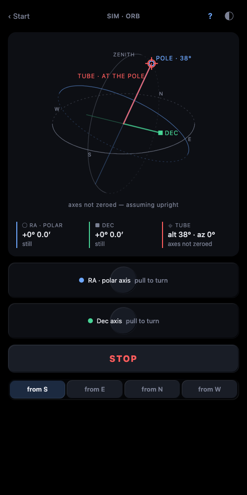
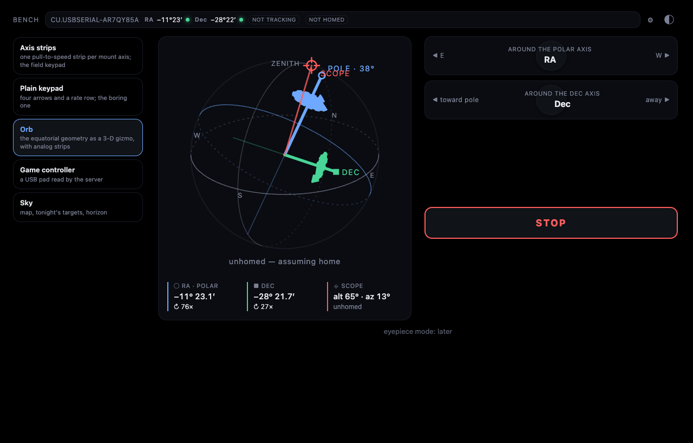
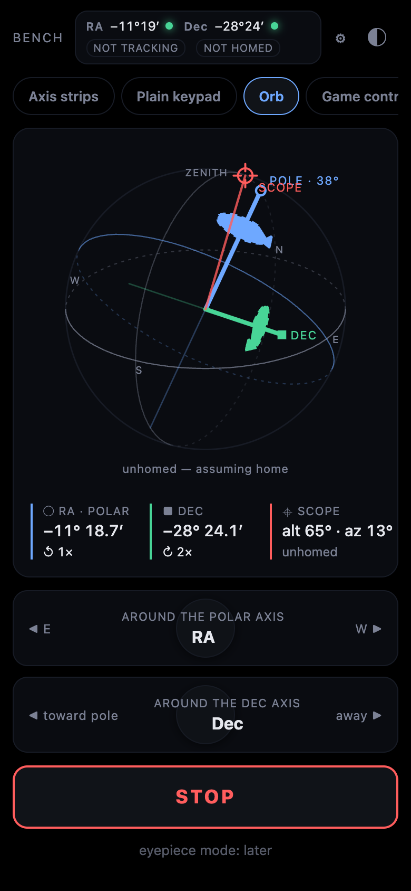

A German equatorial mount is confusing the first ten times you use it. "East" turns the polar axis. "Up" is toward the pole, not toward the zenith. The same patch of sky can be reached two ways. The keypad hides all of that behind four arrows, which is fine right up until the tube is heading for the tripod leg and you don't know which arrow undoes it.

The orb shows it instead.



## What it draws

A small sphere, seen from where you stand in the yard. The horizon ring, the celestial equator, the meridian. The polar axis in blue, tilted to your latitude and turned to the heading you set on Setup, or to whatever the star alignment fitted. The Dec axis in green, square to it. The tube in red, at the current encoder angles. A red crosshair on the sphere says "tube points here".

When a motor runs, three arrowheads lap a faint ring around that axis in the direction of rotation, and the lap time follows the reported rate. That's SVG `animateMotion`, no JavaScript.

Under the sphere are two strips, one per axis. Pull left or right and that axis turns at a speed proportional to the pull; the strip under your finger and the axis on the orb light together. Then STOP, then a row to pick your viewpoint: from S, E, N or W, to match where you're standing or where the webcam is.



## Why it exists

Two reasons.

The first is understanding a GEM in the dark. Watch the strips move the axes on the sphere for a minute and the mount stops being a mystery. You see that turning RA swings the whole Dec axis around the pole, and that the tube can reach a target from either side.

The second is seeing what a setting does before it moves the scope. Flip an axis sign on Setup and the orb's arrowheads reverse. Change the mount heading and the whole geometry swings. Once a star alignment exists, the orb draws the solved geometry, so you can see that the fit thinks your polar axis is 12° east of north before you trust it with a goto.


## How it's made

It's a LiveView. It subscribes to the mount's snapshot, which arrives every 250 ms and on every change, and re-renders. The render is an SVG built from a scene the server computes: a fixed camera south-southeast of the observer, 25° up, so the horizon, the pole and the meridian all read at once.

```elixir
# apps/controller/lib/controller/live/orb_live.ex
# the orb: sphere radius in viewBox units, and a fixed camera south-southeast
# of the observer, 25° up, so the horizon, the pole and the meridian all read
@r 96.0
@cam_el 25.0
@cam_az 150.0

defp project(v, {f, r, u}), do: {@r * dot(v, r), -@r * dot(v, u), dot(v, f)}
```

Every vector is a 3-tuple in an east-north-up frame. `project/2` takes a unit vector and the camera basis and returns screen x, screen y and depth. Rings are sampled into points, projected, and split into a front path and a back path so the back half can be drawn dashed. The three axes are lines from the origin to their projected heads. That's the whole renderer: a few hundred lines of vector arithmetic and a HEEx template with `<path>` and `<line>` tags.

```heex
<circle r={@scene.r} class="rim" />
<path d={@scene.meridian.back} class="ring meridian back" />
<path d={@scene.horizon.back} class="ring horizon back" />
<path d={@scene.equator.back} class="ring equator back" />
<path d={@scene.meridian.front} class="ring meridian" />
```

The only JavaScript is the `Stick` hook on the strips, and it exists because LiveView has no pointer bindings and a held slew needs a heartbeat. It sends the pull vector on a 250 ms interval and a `stick_end` on release. The server turns each into `Mount.slew(ref, axis, rate, hold: true)`, so the driver's dead-man stops the axis if the heartbeat goes quiet.



## What went wrong

**The red dot confused its own author.** At home the tube lies along the polar axis, so the red crosshair sat right on top of the blue pole mark with the word "scope" next to it. I looked at it and could not tell you what it meant, and I wrote it. It now reads "tube · at the pole" when it's there and "tube points here" everywhere else, and it steps aside so the pole mark stays visible.

**The strips flooded the server.** The first version of the `Stick` hook pushed an event on every `pointermove`, which on a phone is 60 to 120 times a second. That's bad on its own, and worse because stale reports could outlive the release: you'd let go and the server would still be chewing through a backlog that said "held". The hook now sends only on its interval, carrying the latest vector, and `stick_end` on release stops the axis instantly. The same lesson as the game pad, learned a second time from a different input: only fresh intent moves the scope.

There was also a stretch where releasing the RA strip while sidereal tracking was on stopped tracking 900 ms later, because the hold's dead-man fired on an axis that had since been told to track. Tracking now cancels a leftover hold on RA.

## What's next

Uncertainty caps on the axes that shrink as alignment stars are added, so the orb says how sure it is. Drag to look around instead of four fixed viewpoints. An eyepiece mode that shows the field the way you'll see it. And the tube line already turns with a camera's measured axes on the Watch page, which is a different post.
