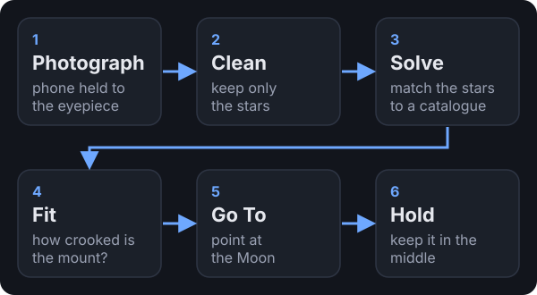
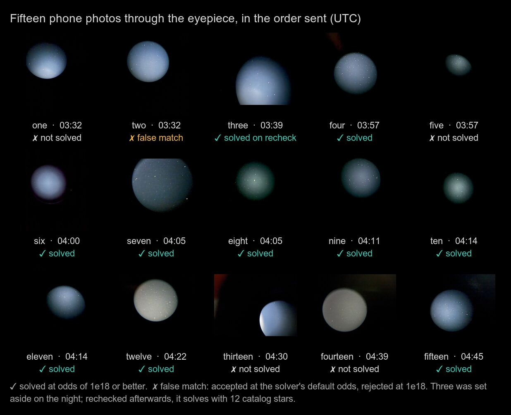
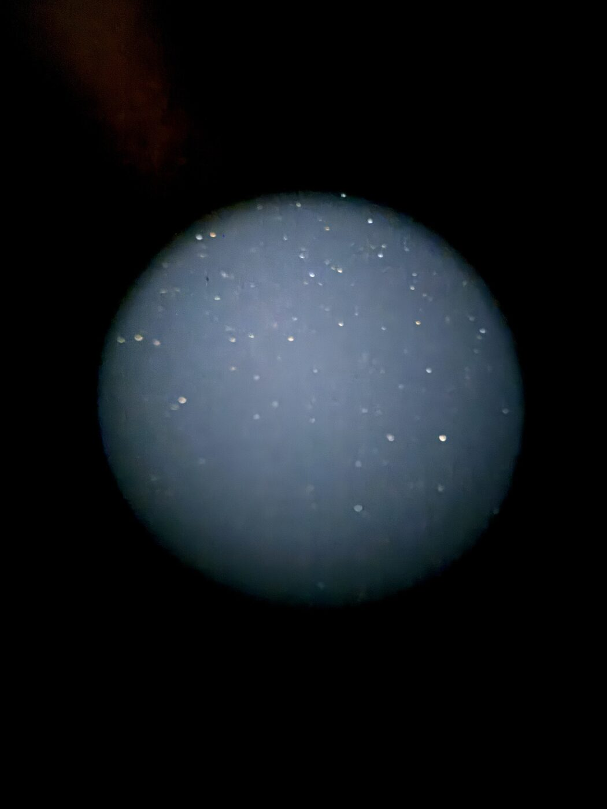
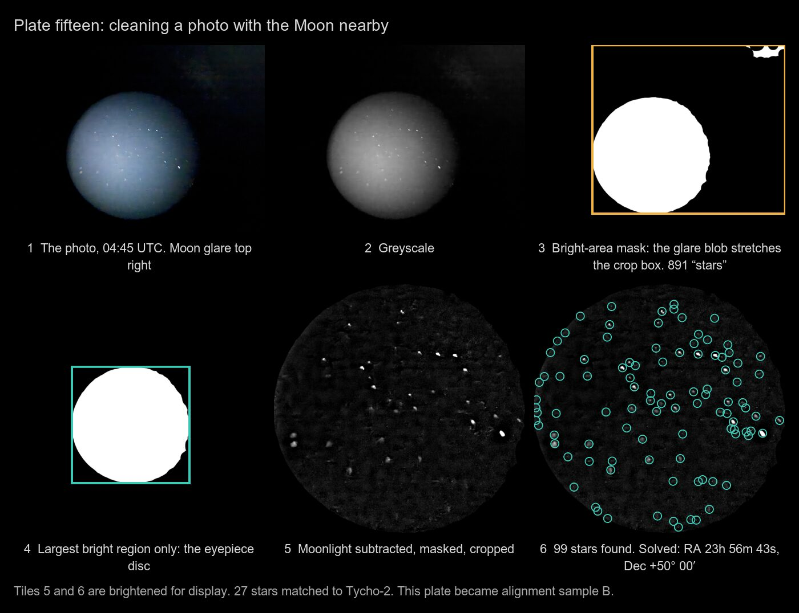
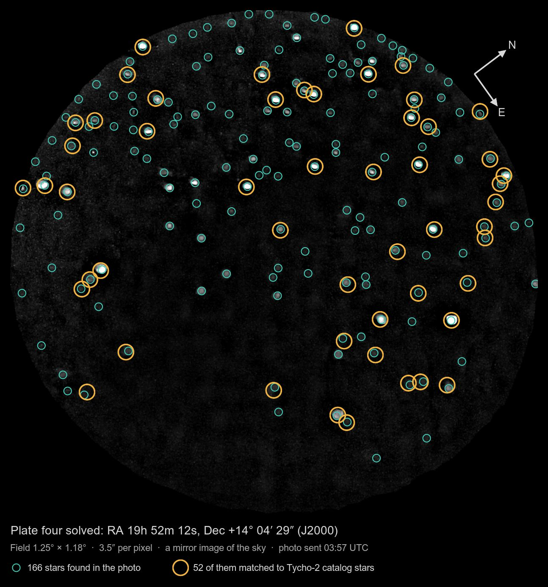
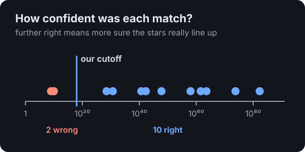
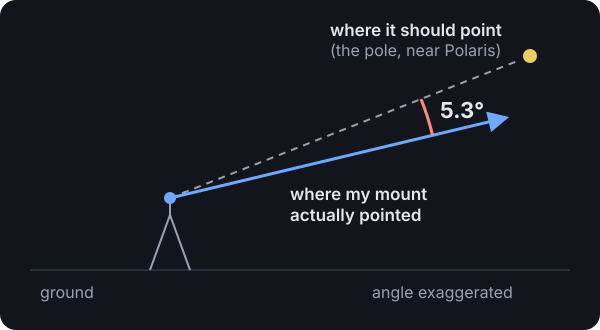
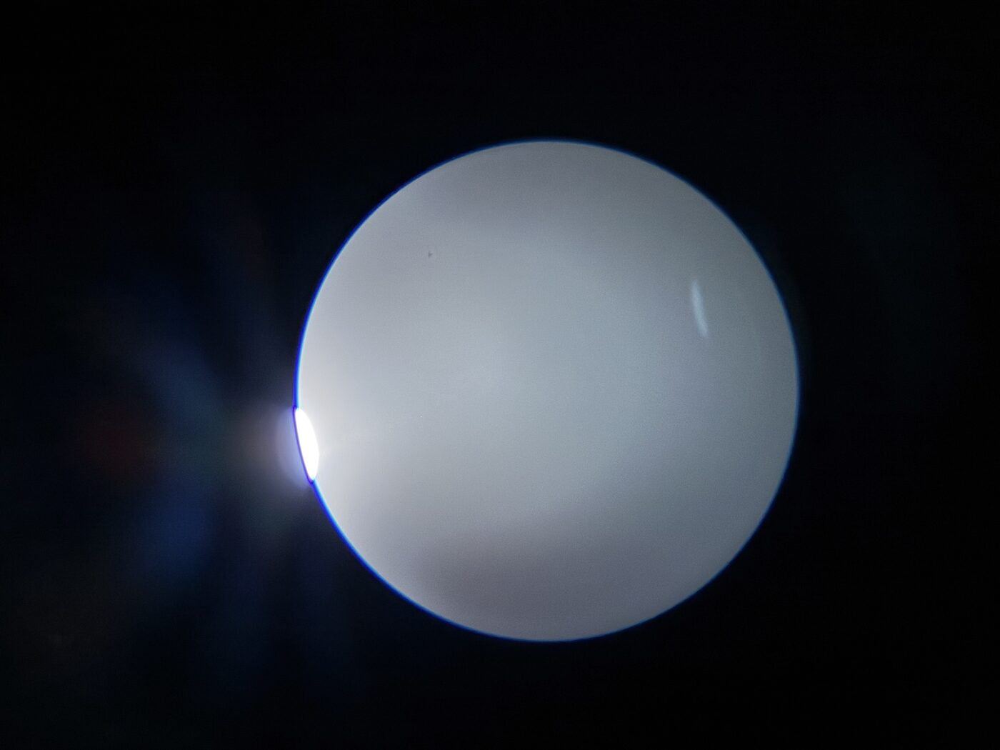
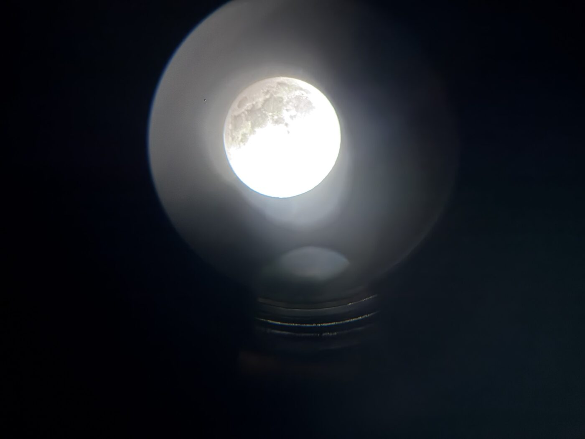
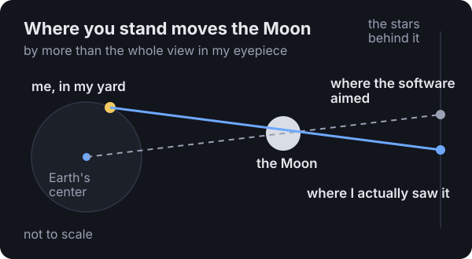

<aside>

**The short version:** normally a telescope needs careful setup before it can find anything. I skipped all of it, took some photos through the eyepiece with my phone, and let software figure out where the telescope was pointing from the stars in them. Two photos were enough for it to work out how crooked the mount was and put the Moon in the middle of the view. Then the numbers didn't quite add up, and chasing that down turned up a 45′ mistake in where it thought the Moon was.

</aside>

## I set up my telescope badly on purpose

My telescope sits on a motorized mount (an EQ6-R). A mount like this is built around one axis that's supposed to point at the celestial pole, the spot near Polaris that the whole sky seems to spin around. When that axis is lined up, following a star is easy: one motor turns slowly and the star stays put. When it's not, every "go to" misses and everything drifts out of view.

So the usual routine is: level the tripod, aim that axis at Polaris, and tell the mount where it's starting from. I did none of it. Polaris is behind my house, I didn't bother leveling, and I never told the mount where it started. All I had was a full Moon washing out the sky, a mount pointed roughly north, and my phone.

What I wanted to know: could somebody who knows nothing about telescopes plop this thing down and have the software figure out how crooked it is?

## The idea is to let photos of the sky do the aiming



Here's the trick. Every photo of the stars is like a fingerprint: the pattern of stars says exactly which patch of sky you're looking at. If software can read that fingerprint, it doesn't matter how crooked the mount is. The photos say where it's really pointing, and the software can work out the rest.

## I stood at the telescope, and Claude did the math

I was out at the telescope with my phone and a game controller, talking. [Claude Code](https://claude.com/claude-code) was running on my Mac with this project open. It looked at the photos I sent, wrote the code, ran the tools, and did the math. When I said "move it down five percent and left twenty," it turned that into motor moves.

What made this work was how we checked each step. Every idea came with a number that could prove it wrong. That habit is what caught the biggest mistake of the night, which I'll get to.

## I held my phone up to the eyepiece and took pictures

There's no camera on the telescope yet. So I held my iPhone up to the eyepiece, took a picture, swung the telescope somewhere else with the controller, and took another. Fifteen in all.



These are messy photos. You get a bright round window floating in black, stars smeared into little comets because my hand shook, and moonlight everywhere.



## First, clean each photo until only the stars are left

The software that reads star patterns wants clean dots of light on black, so we had to strip away everything else. We turned the photo gray, found the round window, and threw away everything outside it. Then we took out the moonlight. That part is a neat trick: moonlight is a smooth glow and stars are tiny points, so if you blur the photo and subtract the blur, the glow cancels out and the stars are left behind.



One photo taught us something. On plate fifteen, glare from the Moon showed up as a second bright blob next to the eyepiece's window, and it got in the way. The fix: the eyepiece is always the biggest bright thing in the picture, so keep that and drop the rest. If you're curious, here's the code:

```elixir
# The eyepiece is the biggest bright region in the photo. Glare from the
# Moon flaring off the eyepiece's edge is a second, smaller one: keep only
# the biggest, and crop to it.
defp eyepiece(mask, dir, opts, deadline) do
  # ask ImageMagick for every bright region, with its size and position
  listing = ["-define", "connected-components:verbose=true", "-connected-components", "8", "null:"]

  with {:ok, out} <- step(:magick, [mask | listing], dir, opts, deadline) do
    case eyepiece_disc(out) do
      # nothing big enough to be an eyepiece: use the photo as it is
      nil ->
        {:ok, nil}

      # repaint the mask with that one region, and crop to its box later
      disc ->
        keep = ["-define", "connected-components:keep-ids=#{disc.id}", "-define", "connected-components:mean-color=true", "-connected-components", "8", "-threshold", "50%", mask]
        with {:ok, _} <- step(:magick, [mask | keep], dir, opts, deadline), do: {:ok, disc}
    end
  end
end
```

## Then match the stars against a star map

This is the magic step, and it's called plate solving. Think about how you'd recognize the Big Dipper: not by any one star, but by the shape the stars make together. A plate solver does the same thing with millions of star patterns from a catalog. When a photo's pattern matches, it knows exactly where the photo was pointing, to a tiny fraction of a degree.

We used a free one called [astrometry.net](https://astrometry.net). The catalog files for a view like mine are 348 MB, small enough to fit on a Raspberry Pi.



Ten of the fifteen photos matched. The other five were too blurry, too tilted, too washed out by the Moon, or just never matched anything real.

## Sometimes the match is wrong, so we set a cutoff

Every match comes with a score for how confident the solver is that the stars really line up. Out of the box, it was willing to accept two matches that were flat-out wrong, each based on just three stars. One of them claimed my phone was pointed at a patch of sky that's below my horizon. Not possible.



The good news is that the wrong answers scored way lower than the right ones. So we raised the cutoff to sit in the gap, and wrote down why:

```elixir
# How sure a match must be before we believe it. The solver's own default
# (10^9) let through two false matches on the first night, each on three
# stars. Every real match scored 10^28 or better.
@min_odds 1.0e18
```

It went the other way once, too. We tossed out one photo that night because the solver's log printed a low score. Turns out that log line is just its first rough guess, and the final score was sky high. The lesson is to read the right number.

## Two photos were enough to tell how crooked the mount is

The software describes my mount with four numbers: which way its axis points (up-down and left-right), and where each motor was when the power came on. Each matched photo pins those numbers down a little more.



Two things made this harder than it sounds.

**The mount had no idea where it started.** The motors just count from wherever they happened to be when I turned them on, so those numbers could be anything. The method we use to fit the numbers gets lost if it starts from a bad guess, so now it tries a whole grid of starting points first and goes from the best one:

```elixir
# The motors count from wherever they were at power-on, so their offsets
# could be anything. Try every pair 10° apart, keep the one that best fits
# the photos, and refine from there.
defp sweep_offsets(samples, signs, start) do
  for(ra <- 0..350//10, dec <- -180..170//10, do: %{start | off_ra: ra / 1, off_dec: dec / 1})
  |> Enum.min_by(fn p -> Enum.reduce(samples, 0.0, &(&2 + residual_deg(p, signs, &1))) end)
end
```

**One photo isn't enough.** With a single photo, the math works out equally well for two completely different ways the mount could be sitting. The first time we tried to go to the Moon on one photo, it pointed the telescope at my garage. So now the rule is small moves only until two photos agree. With two, the telescope swung right up next to the Moon.



The verdict: **my mount's axis was 5.3° off**, a little low and pointed a bit too far west. That's a badly set up mount, and it didn't matter.

## Then we nudged the Moon into the middle and kept it there

From there it was me at the eyepiece saying things like "down five percent, left twenty," and Claude sending the nudges. It took a couple of wrong guesses to figure out which motor moves the view which way.



Keeping it there is the other half. A well set up mount follows the Moon by turning one motor slowly. A crooked one has to keep adjusting both motors, all the time. So every 20 seconds a little loop figured out where the motors should be for where the Moon is now, and moved them the difference.

Over 17 minutes it made 35 tiny corrections, each smaller than a thirtieth of a degree, and the Moon never moved. Without them it would have drifted out of view in about half an hour.

## The Moon was off because the software was standing at the center of the Earth

Here's the part I like best. The photos and the Moon should have agreed with each other about how the mount was set up. They didn't. They disagreed by about 23 arcminutes (an arcminute is a sixtieth of a degree), and the Moon was the odd one out. So we asked why.



The answer: the Moon is close. Hold your thumb out at arm's length and close one eye, then the other, and watch it jump against the background. The Moon does the same thing depending on where you stand on Earth. The software was working out the Moon's position as seen from the center of the Earth, not from my yard, and that alone put it about 45 arcminutes off. That's more than the entire view in my eyepiece.

There was a second, smaller mix-up. Star positions drift slowly over the decades, so star maps are pinned to a particular year, usually 2000. The Moon was being figured for today while everything else was in year-2000 terms, which added about 22 arcminutes more. The two errors partly cancel out, and together they came to about 45.

Once we put the Moon where I actually see it, in the same year-2000 terms as the stars, the photos and the Moon agreed to within 6.6 arcminutes instead of 23. For the curious, this is the fix: take where the Moon is from the Earth's center, and subtract where I'm standing.

```elixir
# Where the Moon is from my yard, not from the center of the Earth.
# `p` is the Moon's position from the Earth's center, with its distance.
def topocentric(%{distance_km: dist} = p, dt, %{lat: lat, lon: lon} = site) do
  phi = lat * @deg
  h = Map.get(site, :elevation_m, 0) / 1000 / @earth_radius_km

  # where I am, relative to the Earth's center, in Earth radii
  # (the Earth is slightly flattened, so latitude needs a correction)
  u = :math.atan(0.99664719 * :math.tan(phi))
  rho_sin = 0.99664719 * :math.sin(u) + h * :math.sin(phi)
  rho_cos = :math.cos(u) + h * :math.cos(phi)
  lst = Astro.lst_deg(dt, lon) * @deg

  # the Moon as a point in space, minus me: the Moon as I see it
  {x, y, z} = vec(p.ra_deg, p.dec_deg, dist / @earth_radius_km)
  {x, y, z} = {x - rho_cos * :math.cos(lst), y - rho_cos * :math.sin(lst), z - rho_sin}
  ...
end
```

We checked it against NASA's [JPL Horizons](https://ssd.jpl.nasa.gov/horizons/) on three different dates, and it's now within about an arcminute and a half of where the Moon really is.

## Here's everything the software has to correct for

Once you start looking, there are a lot of little things between "where the telescope thinks it's pointing" and "where it's actually pointing." Here's the full list from that night, including the ones we haven't handled yet:

| What | How big | Handled? |
|---|---|---|
| Where you stand, for the Moon | about 45′ | Yes, as of this night |
| Star maps pinned to the year 2000 | about 22′ | Yes, as of this night |
| The air bending starlight | about 1′ | Not yet |
| Mount axis tipped up or down | 3.1° | Yes, measured from photos |
| Mount axis turned left or right | 5.3° | Yes, measured from photos |
| Where each motor started | anything at all | Yes, measured from photos |
| The tripod not being level | hidden in the two above | Needs a level |
| Small wobbles in the tube and gears | a few arcminutes | Not yet |
| Photo times | up to 11′ | Guessed, since the phone's times got lost |
| Me centering by eye | about 1% of the view | That's just me |

The tripod row is my favorite. Looking at the sky alone, you can't tell a tripod that isn't level from a mount that's aimed wrong. The stars only see where the axis ends up. Put a level on the mount and the software could tell you "this much is the tripod, turn this bolt that much."

## What I'd do differently next time

**Don't trust one photo.** One photo can't tell which of two ways the mount is sitting, and that's how the telescope ended up pointed at my garage. Now nothing big moves until two photos agree.

**Don't take the solver's word for it.** Left at its default setting, it happily reported a spot below my horizon. The cutoff fixed that, and later we added a check that throws out any match that's below the horizon.

**Keep the photo times.** Sending the photos from my phone stripped off when they were taken, so each time was a guess within 45 seconds. The sky turns fast enough that 45 seconds is up to 11 arcminutes of error, which is a lot when you're trying to measure things this precisely.

**Agree on what "up" means.** Up in the eyepiece, up in a photo, and up on a motor are three different directions. That's why a few of my nudges went the wrong way. It's also why the next thing I built was a way to steer by what I see instead.

## How the AI helped, and where it didn't

**It's fast at the parts that are slow for me.** Geometry, fitting numbers, star catalog math, and writing and running the code, all while I stayed out at the eyepiece. I didn't touch a keyboard all night.

**The numbers caught its mistakes.** Nobody spotted the wrong Moon by looking at it. Three measurements that should have agreed didn't, and asking why led straight to it.

**It needs guardrails like any software.** It would have believed a match that was below the horizon. We only caught that because we asked whether the answer made sense.

**I kept the safety calls.** The garage is why big moves wait for two photos. That rule came from me standing next to the telescope watching it swing the wrong way.

## Where this goes next

The next steps are about taking my Mac out of the loop. The software should keep a running record of where the mount is pointing, so a photo's timestamp tells you exactly where the telescope was. A tilt reading from the phone would split "the tripod isn't level" from "the mount is aimed wrong." And all of this should run on the little computer on the telescope itself. That part is done now: see [the Moon we couldn't go to](2026-09-26-the-moon-we-couldnt-go-to.html). So is steering by what you see in the eyepiece: see [up is up](2026-09-26-up-is-up-steering-by-the-eyepiece.html).
