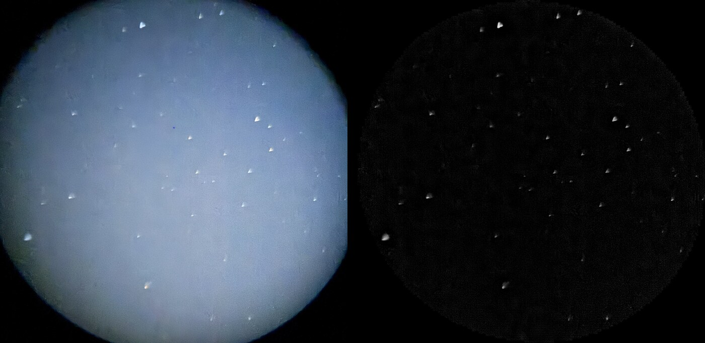
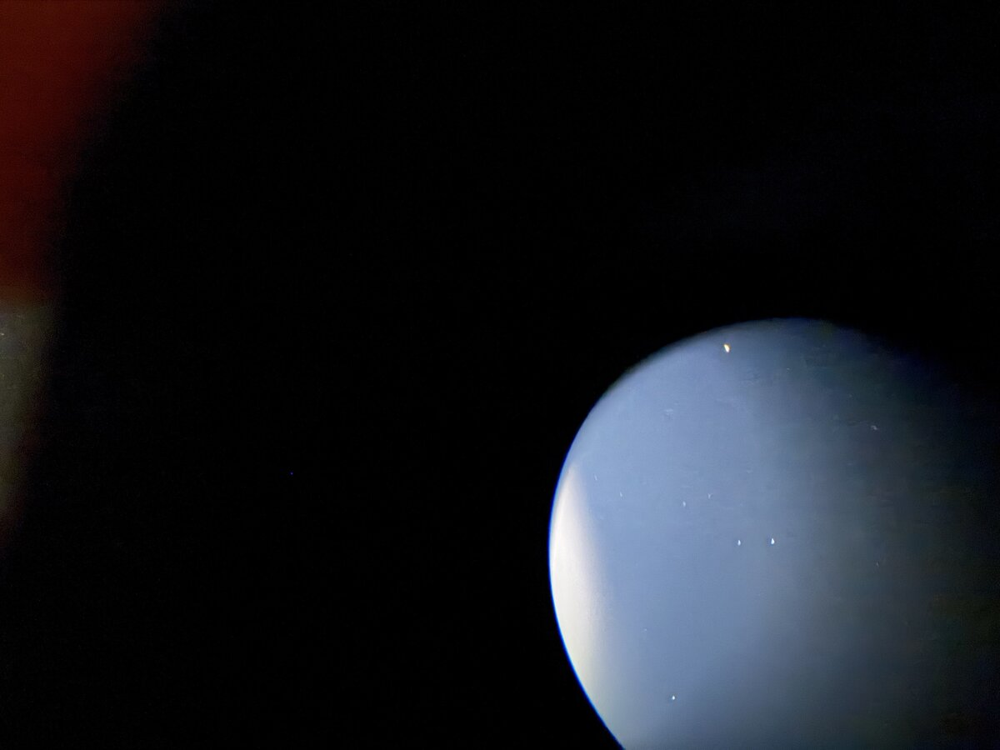

The last Go To of the first field night was to the Moon, and the software refused it: past the meridian. I was standing at the scope and nothing was in the way. The refusal was a bug, and under the bug was a real safety gap. Fixing that, and getting the box to solve its own photos, was the overnight work.

## Two ways to every star

A German equatorial reaches every point in the sky two ways, one from each side of the pier. Turn RA half a turn, mirror Dec, and the tube points at the same star with the whole mount the other way round.

Go To only looked at the pose nearest where the tube already was. For the Moon, that pose had the counterweight above level, so it said no. The other pose, a meridian flip with the counterweight well down, was never considered. And the check itself computed `side * H`, which is right on the side of the pier we'd used all night and backwards on the other. On the far side it would read a counterweight 20° *below* level as 160° past.

## Where the counterweight is

The fix starts with a fact I should have written down on day one: the counterweight shaft *is* the Dec axis. So its height depends only on the RA axis. It's level when the tube is on the meridian, and straight down or straight up a quarter turn either side.

Which of those two is down isn't in the pointing. Both poses see exactly the same sky, so no star can tell you. On a zeroed mount, home says it, but this one was never zeroed: encoder zero is wherever it woke up, and the fit put it 60° from where home would be. So the answer comes from people. Every alignment point was someone centring a star at the eyepiece, and nobody does that with the counterweight in the air. The sign that puts most of the points below level is the one.

```elixir
# apps/controller/lib/controller/sky/model.ex
def counterweight(params, signs, theta_ra) do
  h = (signs.ha_sign * theta_ra + params.off_ra) * @deg
  Map.get(params, :cw, 1) * :math.asin(:math.sin(h)) / @deg
end

def cw_down(params, signs, thetas) do
  lean = thetas |> Enum.map(&counterweight(Map.put(params, :cw, 1), signs, &1)) |> Enum.sum()
  if lean > 0, do: -1, else: 1
end
```

`asin(sin h)` is the whole trick: a triangle wave, level at 0° and 180°, straight up or down at the quarter turns. All eight of the first night's points agree on which way is down.

## Worse: no limit at all

`Mount.set_home` is what arms the soft limits, so a mount that was never homed has none. And the model tracker, the thing holding the Moon, had no meridian stop of its own; it relied on the soft limits. Left alone, it would have carried the Moon across the meridian and the tube into the tripod legs, slowly, after I'd gone to bed. The only guard that night was a person awake at the scope.

## Go To, the careful way

`Pointing.landing/4` looks at both poses. It stays on this side of the pier while the counterweight is within 3° of level, and otherwise plans a flip. RA turns whichever way keeps the counterweight lowest along the whole path, not just at the end:

```elixir
# apps/controller/lib/controller/sky/pointing.ex
# the short way round, unless the long way keeps the counterweight lower
defp ra_turn(ctx, from, to) do
  short = Astro.norm180(to - from)
  long = if short > 0, do: short - 360, else: short + 360
  Enum.min_by([short, long], &{Float.round(highest(ctx, from, &1), 0), abs(&1)})
end
```

Dec goes through the pole, never through the point opposite it, because that path swings the tube through the ground.

A flip shouldn't just happen. At the scope I'd put it plainly: "take it to where you think it's dangerous, and then stop and check." So `Controller.Sky.Moves` flips in two legs. The first goes home: counterweight straight down, tube at the pole, the most compact pose the mount has. It stops there, and every phone asks:

> Home, halfway to the Moon. Is the way clear?

Any phone can answer **Continue to the Moon**, and STOP anywhere cancels the move. The pending move belongs to the telescope, not a page, so the question is on every screen at once.

The hold got its limit too. On a never-zeroed mount it stops when the counterweight reaches 20° above level, about where an EQ6-R's tube can reach the legs, and says why: "the counterweight reached its limit. Go To again flips the mount and holds it from the other side."

None of this has flipped a real mount yet. That's first on the list for next time.

## A correction: the step count can't see a leg

While I was in the driver I added stall detection: if an axis the board says is running stops counting, both axes stop. My first note said it would catch the tube hitting a tripod leg. It can't.

The EQ6-R's motors are steppers, and "position" is the count of steps the board *sent*. A tube pushed against a leg skips steps and the count carries on. What the watch catches is a board that stopped stepping while still saying "running": a fault, or the supply sagging under load. So the page says exactly that: "RA stopped counting while told to move."

```elixir
# apps/mount/lib/mount/server.ex
# What this cannot see: the EQ6-R's motors are steppers and the count is
# the steps the board sent, so a tube against a tripod leg skips steps and
# the count carries on. Seeing that takes something watching the tube
# itself (the camera, a tilt sensor on the tube).
```

Real collision detection needs a sensor on the tube ([#98](https://github.com/bradgessler/observatory/issues/98)). Until then the guard is the two-leg flip and a person looking.

## The box had never solved a photo

The box has the solver built into its image and the Tycho-2 index files on its data partition. It had never solved a photo. The solver's config pointed at `~/.observatory`, where there was nothing, so the box found no solver of its own, found the Mac on the cluster, and quietly sent every photo over Erlang distribution.

```elixir
# firmware/config/target.exs
# The plate solver's Tycho-2 indexes (hundreds of MB) live on /data too, not
# in the image. Without this the solver looked in ~/.observatory, found
# nothing, and every photo went to the Mac over the network: fine at home,
# nothing at all in a field.
config :controller, :solver, index_config: "/data/astrometry/astrometry.cfg"
```

The second problem: the cleaning that made the [first night's phone photos](2026-09-25-phone-photos-and-the-wrong-moon.html) solvable at all (find the eyepiece's disc, shave off its rim, take away the moonlight, crop) ran on ImageMagick. The Pi doesn't have ImageMagick.

## Cleaning a photo in Elixir

`Controller.Sky.Solve.Clean` does the same steps in under 300 lines:

- **The disc**, from `djpeg`'s 1/8-scale copy: blurred, thresholded at 8%, eroded so the rim is gone. Rows are kept as runs of lit pixels, so erosion is interval arithmetic: shrink the runs above and below by the disc's half-width at that height, and intersect.
- **The biggest region**, by union-find over runs. Moonlight flaring off the edge is a second region and gets left out.
- **The moonlight**, from the same small copy blurred hard.
- **The subtraction**, row by row, with binary pattern matching:

```elixir
defp minus(<<p, ps::binary>>, <<b, bs::binary>>, acc) when p > b, do: minus(ps, bs, <<acc::binary, p - b>>)
defp minus(<<_, ps::binary>>, <<_, bs::binary>>, acc), do: minus(ps, bs, <<acc::binary, 0>>)
defp minus(<<>>, _, acc), do: acc
```



That's plate two, the one ImageMagick never solved. On the Mac the cleaning takes a fifth of a second. All fifteen of the first night's photos, solved on the Mac both ways:

| Plate | ImageMagick | Elixir | Positions agree to |
|---|---|---|---|
| two | no solve | 17.6 s | |
| three | 13.8 s | 0.6 s | 0.2′ |
| four | 13.2 s | 0.5 s | 0.2′ |
| six | 20.8 s | 6.9 s | 0.3′ |
| seven | 14.3 s | 0.8 s | 0.4′ |
| eight | 14.8 s | 1.3 s | 0.2′ |
| nine | 13.6 s | 0.5 s | 0.4′ |
| ten | 40.4 s | 2.4 s | 0.1′ |
| eleven | 13.5 s | 0.4 s | 0.5′ |
| twelve | 31.4 s | 18.2 s | 0.7′ |
| fifteen | 14.4 s | 0.4 s | 0.3′ |

The same ten plus plate two. One, five, thirteen and fourteen didn't solve either way. Where both solved, they agree to within 0.7′, about a hundredth of a degree.

## On a Pi 3

The box is a Raspberry Pi 3 running 32-bit, where the BEAM has no JIT. Cleaning one photo took three rounds to get quick: 7.6 to 22.7 s, then 3.7 to 6.4 s, then 1.7 to 4.3 s.

What made the difference was getting out of per-pixel work: no floats to box, no closure per pixel, no tuples to index. A blur is now a sliding sum over a list of whole numbers, one add and one subtract per step:

```elixir
defp slide(_trail, [], sum, k, acc), do: Enum.reverse([div(sum, k) | acc])
defp slide([t | trail], [l | lead], sum, k, acc), do: slide(trail, lead, sum - t + l, k, [div(sum, k) | acc])
```

End to end on the Pi, with a hint for where to look, a phone photo solves in 9 to 13 seconds.

## A match below the horizon

One in-between version worked on half-size photos, and it "solved" plate thirteen, which is mostly Moon glare and a handful of stars. It put the photo at Dec −69°, with odds that cleared the 10¹⁸ bar from last time. Dec −69° never rises here.



Odds say how sure the solver is that the stars match the catalogue. They don't know where you're standing. So a solve now gets the photo's time and the site, and a match below the horizon is refused however good its odds:

```elixir
# apps/controller/lib/controller/sky/solve.ex
defp above_horizon({:ok, %{ra_deg: ra, dec_deg: dec}} = ok, %{at: %DateTime{} = at, site: %{lat: lat, lon: lon}}) do
  {alt, _} = Astro.alt_az(ra, dec, lat, Astro.lst_deg(at, lon))
  if alt < -2.0, do: {:error, :below_horizon}, else: ok
end
```

The final full-size version doesn't match plate thirteen at all, which is the honest answer.

## What went wrong

- **Go To looked at one pose**, and its meridian check was backwards on the side of the pier we hadn't used.
- **The hold had no limit** on a mount with no soft limits.
- **I oversold stall detection.** A step count can't feel a tripod leg.
- **The box wasn't solving; the Mac was.** One config path, and a fallback that worked too well to notice.
- **A half-size cleaning found a sky that never rises.** Now the horizon gets a vote.

## What's next

Field night 2 ([#104](https://github.com/bradgessler/observatory/issues/104)):

- **Plate alignment on the box**, end to end: phone photos through the eyepiece, uploaded on the page, solved on the Pi, spread across the sky.
- **A first real meridian flip.** After it the model has no points on that side of the pier, so expect a worse landing; tap Centered there and see how far the margin moves.
- **Adversarial slews.** Throw the scope somewhere with the pad, Go To back, log how far off it lands, again and again.
- **Spiral Search sized by the margin** ([#100](https://github.com/bradgessler/observatory/issues/100)), on the box as of tonight: views a bit under the eyepiece's field apart, out to three times the margin and no further, with **I See It** holding wherever it stopped. Time it against a loosened alignment.
