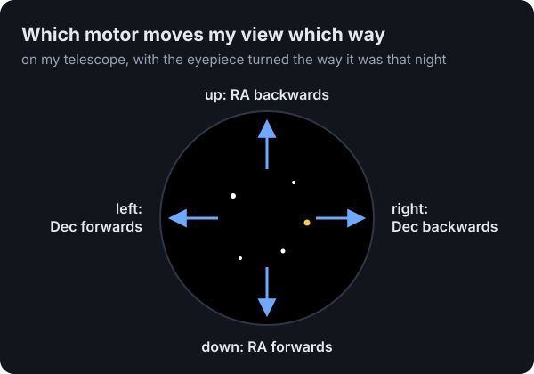
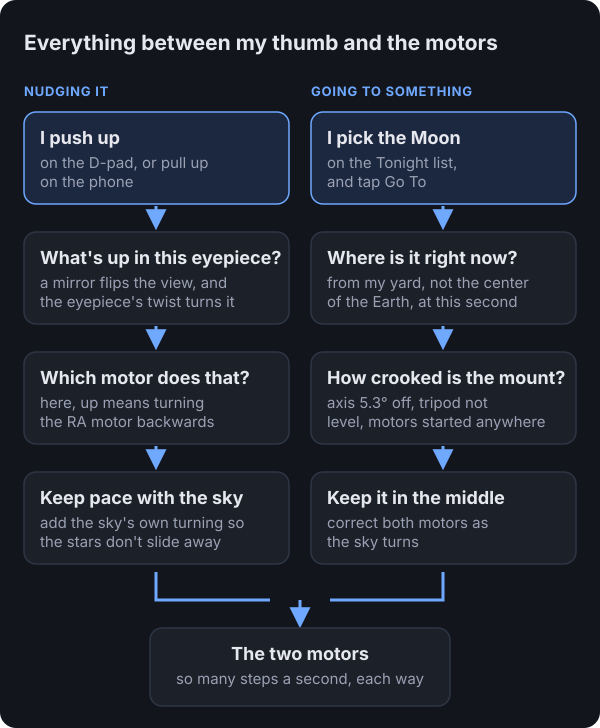
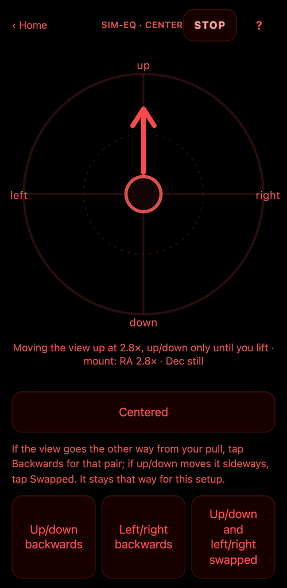
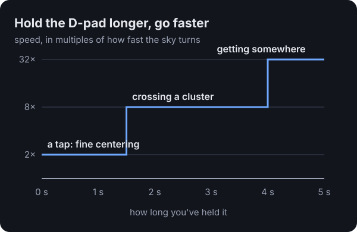

<aside>

**The short version:** a telescope's motors turn in directions that mean nothing when your eye is at the eyepiece. So I made the controls talk about the view instead. Push up, the view goes up. A phone becomes a touchpad shaped like the eyepiece, and a game controller's D-pad crawls for fine centering and speeds up when you hold it. Getting there meant working out every layer between my thumb and the motors.

</aside>

## How I got here

[Last time](2026-09-25-phone-photos-and-the-wrong-moon.html), I set up my telescope badly on purpose and let an AI figure out how crooked it was from photos I took through the eyepiece with my phone. That got the Moon into view. Getting it into the *middle* of the view was a different story.

I'd be at the eyepiece saying "down five percent, left twenty," and Claude would send a nudge. Half the time it went the wrong way. Not because anyone was careless, but because "down" in the eyepiece, "down" in a photo, and "down" on a motor are three different things.

That's when it clicked for me. This whole rig, the mount, the motors, the alignment math, all of it, exists to serve one thing: the little circle of sky I'm looking at. So the controls should talk about that circle. If I want the view to go up, I push up.

## Why "up" is confusing on a telescope

A mount like mine has two motors. One turns the telescope around an axis pointed at the pole (called RA), and the other tips it toward or away from the pole (called Dec). Those names make sense on a star chart. At the eyepiece they mean nothing.

The light also bounces off a mirror on its way to your eye, which flips the picture. The eyepiece can be twisted in its holder, which rotates the picture. And a mount like mine can reach a star from either side of its central post, which turns everything upside down. So which motor moves the view up depends on all of that at once.

The software keeps this as a tiny map: which motor, and which way, moves the view down and which moves it right. Up and left are just the opposites. If you set things up differently, two buttons fix it. One says "up and down are backwards," one says "left and right are backwards," and a third turns the whole map a quarter turn for when the eyepiece gets twisted in its holder. Mine did, somewhere between the Moon and Saturn.

## Here's everything between my thumb and the motors

When I push up on the D-pad, that simple wish goes through a surprising number of layers before a motor turns. And when I ask to go to the Moon, it goes through a different set: where the Moon is right now from my yard, and how crooked my mount is, which is what the [last post](2026-09-25-phone-photos-and-the-wrong-moon.html) was about.

The layer that surprised me most is "keep pace with the sky." The sky is always turning, so the RA motor is always running slowly to keep up. If a nudge ignored that, the stars would lurch the moment you touched the controls. So every nudge rides on top of the tracking, and when you let go, it goes back to just tracking.

## On a phone, the eyepiece becomes a touchpad

Put your thumb anywhere on the circle and pull the way you want the view to move. A short pull crawls, and pulling to the edge moves about sixteen times faster. Let go and it stops. Underneath, a line says what the motors are actually doing, so you know your thumb is working.

It's always red, because that's the only color that doesn't ruin your night vision. The first version drew a white circle, which I described at the time as "a big white light blasting in my eyeballs."

## On the game controller, the D-pad crawls, then hurries

The controller's D-pad moves the view the same way, using the same map, so fixing a backwards direction on the phone fixes the controller too.

At first it only crawled, which is perfect for putting Saturn dead center and painful for anything bigger. Crossing the Pleiades, a star cluster about four Moons wide, took minutes. So now the longer you hold, the faster it goes.

## Three things I only learned out in the dark

**Start the pull where your thumb lands.** The first touchpad measured your pull from the middle of the circle. With your eye at the eyepiece you can't see where the middle is, so wherever your thumb came down already counted as a pull in some direction. My complaint that night was "my thumb is just not following the screen." Now wherever your thumb lands is the starting point, and there's a small dead zone so resting your thumb doesn't move anything.

**One direction per touch.** A thumb that means "up" drifts sideways without you noticing, and Saturn slides out the side. So the first real pull decides the direction, and that's the only way that touch moves until you lift your thumb. The screen tells you: "up/down only until you lift."

**Know which version someone's running before you fix their bug.** From the eyepiece I reported that the D-pad's directions were crossed: left and right moved the view up and down. Claude "fixed" the map. But my report came in while an update to the telescope's computer was still installing, so I was still on the old version, where the D-pad drove the motors directly. The new map had been right all along, so we put it back.

## How the AI helped

I never touched a keyboard. I'd describe what I saw ("Saturn moved up and to the left"), and Claude would work out which motor did what, update the map, and push the change to the little computer on the telescope while I stayed at the eyepiece. What it couldn't do was feel whether the touchpad was comfortable. Every one of those fixes, the thumb starting point, the dead zone, the speed curve, the red screen, came from me standing in the dark saying "that's not right."

## Where this goes next

Saturn and the Pleiades both got centered by feel, with no thinking about motors. Since then, pressing Centered on the controller also teaches the alignment something every time you do it, so the next "go to" lands closer. The next obvious step is the upside-down problem: when the mount swings to the other side of its post to reach something (a "meridian flip," which I wrote about in [the Moon we couldn't go to](2026-09-26-the-moon-we-couldnt-go-to.html)), the whole view turns upside down. The software knows when it does that, so it should flip the map for you.
